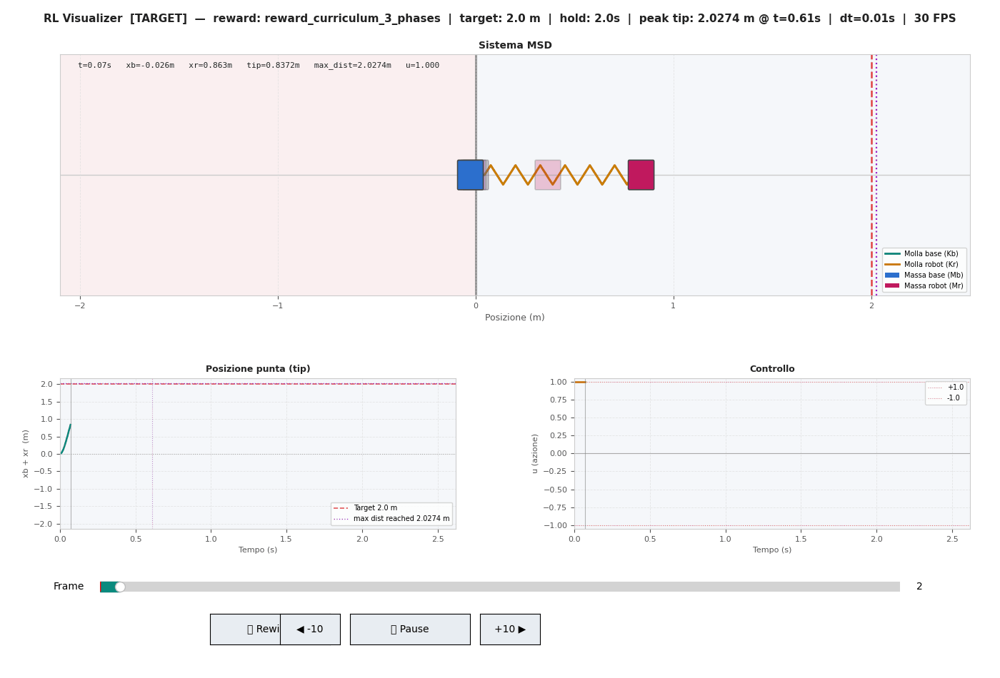
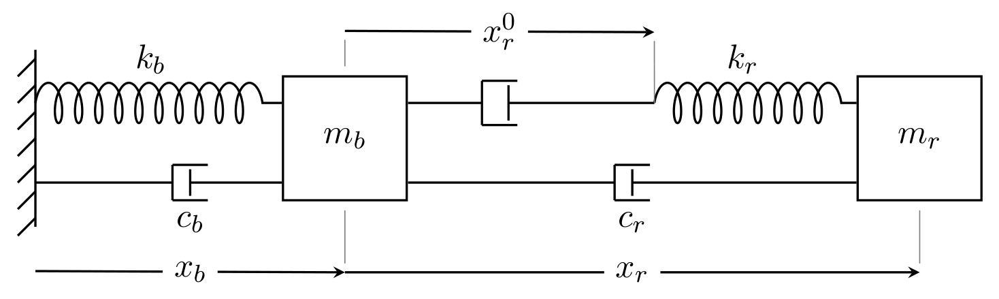
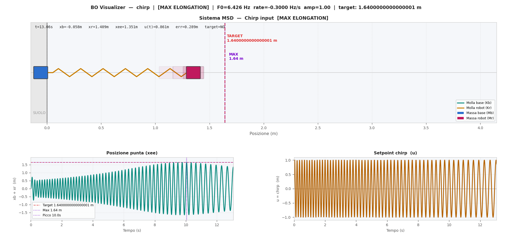
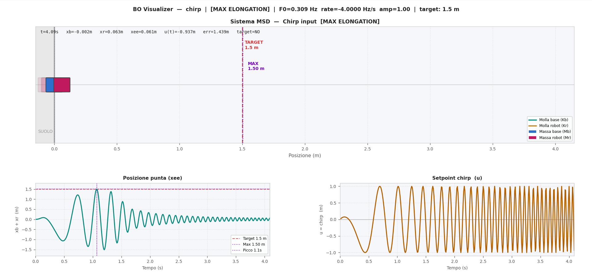
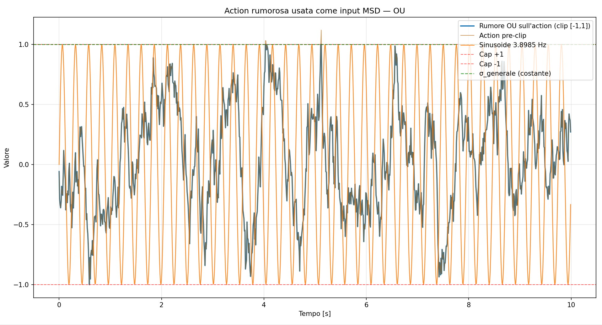
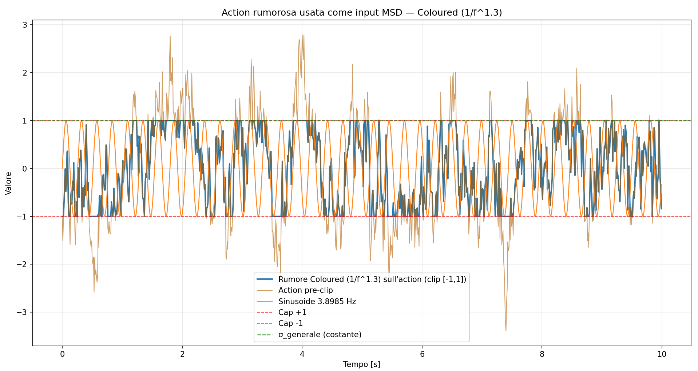
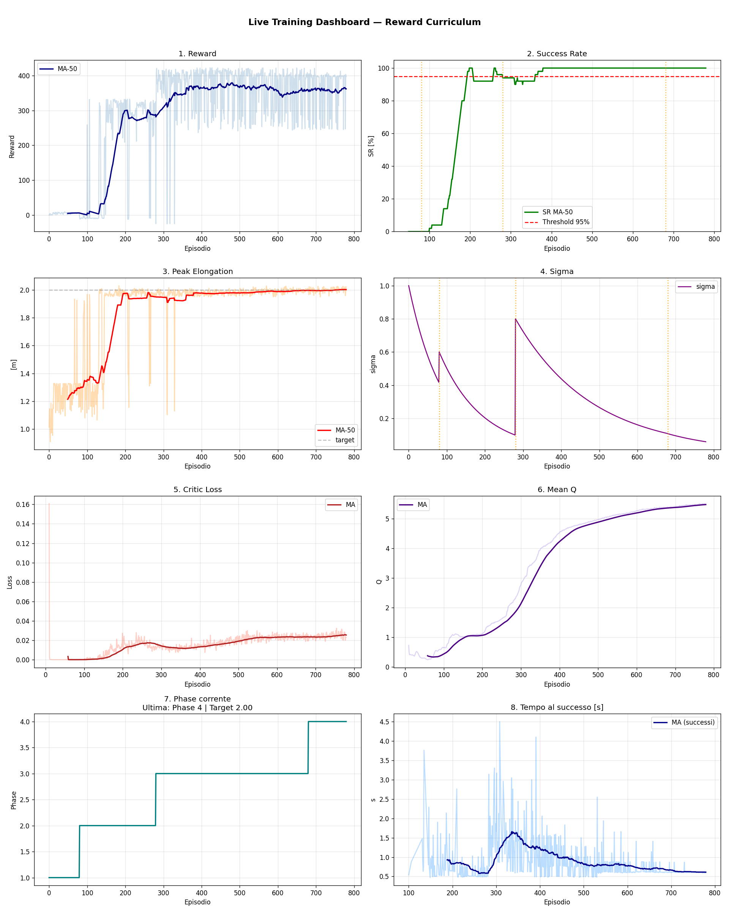
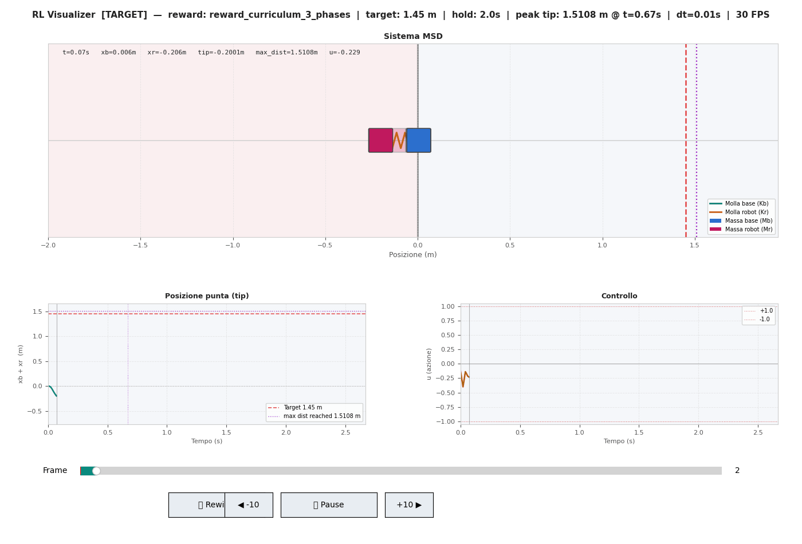
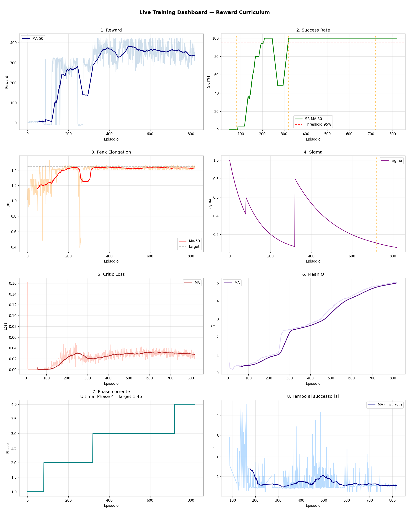
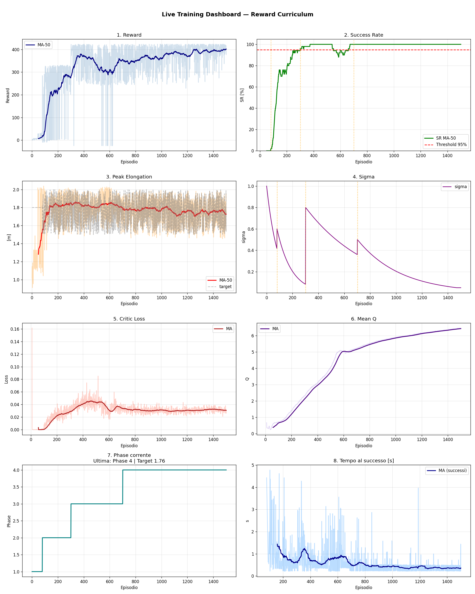

# 🤖 Bayesian Optimization and Reinforcement Learning for Robotic Control

> **University Project — Machine Learning for Mechanical Systems (MLMS)**  
> Politecnico di Milano · A.Y. 2025/2026

[](https://www.python.org/)
[](https://pytorch.org/)
[](https://scikit-optimize.github.io/)
[](LICENSE)

---

## 🎬 Demo — Dynamic Trajectory Execution

<p align="center">
  
</p>

> Real time simulation of the trained policy controlling the robotic arm. By injecting energy and exciting the flexible base oscillations (`xb`), the end effector (`x_ee = xb + xr`) reaches the target position (`2.0 m`) well beyond the static kinematic reach of the arm, stopping with near zero residual velocity.

---

## 🎯 Project Overview

This project investigates the dynamic trajectory generation and feedback control of a **1 DoF robotic arm mounted on a compliant base**. The target locations are positioned **strictly beyond the static reach of the robot** (`xr ≤ 1.0 m`) and can only be reached by exciting the natural resonance of the flexible support structure.

Two control methodologies are implemented, analyzed, and compared:

1. **Bayesian Optimization (BO)**: Optimizes the parameters of an input chirp trajectory using Gaussian Process surrogates to maximize reach or achieve time optimal target acquisition.
2. **Deep Reinforcement Learning (DDPG in PyTorch)**: Trains a continuous Actor Critic neural policy using energy based reward shaping and a 4 phase curriculum to reach arbitrary targets.

---

## ⚙️ The Physical System and Discretization

<p align="center">
  
</p>

### Lumped Parameter Dynamic Model

The physical system is modeled as a coupled 2 DoF mass spring damper mechanism ([*Roveda et al., Mechatronics 2016*](https://doi.org/10.1016/j.mechatronics.2016.06.004)), consisting of:
1. **Compliant Base (`Mb, Kb, Db`)**: Represents the flexibility of the mounting frame.
2. **Robotic Arm (`Mr, Kr, Dr`)**: Represents a 1 DoF Cartesian impedance controlled manipulator mounted on the base.

The coupled equations of motion in matrix form are:

```
[ Mr + Mb   Mr ] [ ẍb ]   [ Db·ẋb + Kb·(xb - xb0)    ]   [ 0 ]
[   Mr      Mr ] [ ẍr ] + [ Dr·ẋr + Kr·(xr - xr0(t)) ] = [ 0 ]
```

Where:
- `xb(t)`: absolute displacement of the compliant base from equilibrium (`xb0 = 0`)
- `xr(t)`: relative displacement of the robotic arm relative to the base
- `x_ee(t) = xb(t) + xr(t)`: absolute position of the end effector
- `xr0(t)`: commanded actuator setpoint position (control input `u(t) ∈ [-1.0, +1.0] m`)

### System Parameters and Resonance

| Parameter | Value | Physical Meaning |
|---|---|---|
| `Mb` | 70.0 kg | Mass of the compliant base |
| `Kb` | 4000 N/m | Base structural stiffness |
| `ζb` | 0.25 | Base damping ratio |
| `Db` | 264.58 N·s/m | Base viscous damping coefficient (`2·√(Kb·Mb)·ζb`) |
| `Mr` | 2.5 kg | Robot Cartesian impedance mass |
| `Kr` | 1500 N/m | Robot Cartesian stiffness |
| `ζr` | 0.30 | Robot damping ratio |
| `Dr` | 36.74 N·s/m | Robot viscous damping coefficient (`2·√(Kr·Mr)·ζr`) |
| `X_max` | 2.0 m | Robot physical stroke range (`[-1.0, +1.0] m`) |

- **Static Kinematic Reach**: Under static conditions (`xb = 0`), the maximum reach is `x_ee = 1.0 m`.
- **Dynamic Resonance Exploitation**: The system has two natural resonance frequencies at **`f₁ ≈ 1.20 Hz`** (`ω_n,1 ≈ 7.56 rad/s`) and **`f₂ ≈ 3.90 Hz`** (`ω_n,2 ≈ 24.5 rad/s`). By actively exciting these modes, the robot can extend the end effector to **`x_ee = 2.0 m`** (a 100% reach increase over the static limit).

### Numerical Time Discretization

- **Integration Method**: 4th order Runge Kutta (RK4 / RK45) with fixed time step **`Δt = 0.01 s`** (`fs = 100 Hz`).
- **Nyquist Validation**: The sampling frequency `fs = 100 Hz` is over 25 times higher than the highest natural frequency (`f₂ ≈ 3.90 Hz`), ensuring zero numerical aliasing and accurate phase tracking during resonance excitation.
- **Episode Duration**: `T_max = 5.0 s` to `10.0 s` (`500` to `1000` simulation steps per episode).

---

## 📁 Repository Structure

```
bayesian-optimization-and-reinforcement-learning-for-robotic-control/
│
├── msd_simulator_core.py          # Lightweight ODE simulator for BO (RK45, adaptive step)
├── msd_simulator.py               # Full simulator with live plotting and step integration
│
├── MAX_BO.py                      # BO for maximum elongation (2D search space)
├── bayes_opt_chirp_2.py           # BO for target reaching (3D search space)
│
├── RL_goal_curriculum_shaping_refactored_phase4.py
│                                  # Full DDPG pipeline with 4 phase adaptive curriculum
├── analyze_state_ranges.py        # State space distribution analysis utility
│
├── media/                         # Visual assets, training dashboards, and demo animations
│   ├── system_model_diagram.png   # 2 DoF coupled mass spring damper schematic
│   ├── demo_trajectory_target_2_0.gif
│   ├── demo_actuator_limited_1_45.gif
│   ├── bo_max_elongation.png
│   ├── bo_target_reaching.png
│   ├── noise_ou.png
│   ├── noise_coloured.png
│   ├── rl_dashboard_target_2_0.png
│   ├── rl_dashboard_actuator_limit.png
│   └── rl_dashboard_multitarget.png
│
└── visualization/                 # Post training visualization and evaluation tools
    ├── visualize_rl_run.py        # Training dashboard replay from CSV logs
    ├── visualize_bo_chirp.py      # BO convergence and GP surrogate landscape heatmaps
    ├── msd_noise_visualizer.py    # Exploration noise spectrum comparison
    └── interactive_game.py        # Manual keyboard control of the compliant robot
```

---

## 🔬 Approach 1: Bayesian Optimization

### Chirp Input Parameterization

The commanded actuator position setpoint `xr0(t)` is defined as a frequency swept sinusoidal chirp:

```
xr0(t) = A · sin( 2π · (f0·t + 0.5·f_dot·t²) )
```

| Parameter | Search Range | Description |
|---|---|---|
| `f0` (`F0_CHIRP`) | `[0.01, 25.0] Hz` | Initial chirp frequency |
| `f_dot` (`CHIRP_RATE`) | `[-5.0, +5.0] Hz/s` | Frequency sweep rate |
| `A` (`AMP_FRACTION`) | `[0.10, 1.00]` or fixed `1.0` | Amplitude fraction of the maximum stroke |

### Optimization Tasks

1. **Maximum Elongation (`MAX_BO.py`)**:
   - 2D parameter space `(f0, f_dot)` evaluated under full actuator stroke (`A = 1.0`).
   - Objective: minimize `Loss = -x_ee,max`.
   - Uses a Gaussian Process surrogate with Matérn kernel, Expected Improvement (EI) acquisition, and Latin Hypercube Sampling (LHS) initialization.

<p align="center">
  
</p>

2. **Target Reaching (`bayes_opt_chirp_2.py`)**:
   - 3D parameter space `(f0, f_dot, A)`.
   - Loss balances reaching accuracy (`|x_ee,max - X_target|`) and time to target with explicit penalties for failing to reach the objective.

<p align="center">
  
</p>

---

## 🧠 Approach 2: Deep Reinforcement Learning (DDPG)

### Actor Critic Architecture

- **State Space (5D)**: `[xb, ẋb, xr, ẋr, X_target]` normalized by the scaling vector `[0.15, 1.5, 2.0, 40.0, 2.0]`.
- **Action Space (1D)**: Continuous actuator setpoint command `u ∈ [-1.0, +1.0]`.
- **Actor Network**: 2 hidden layers (64 units each), ELU activations, Tanh output initialized with small uniform weights (`±3 × 10⁻³`) to avoid early saturation.
- **Critic Network**: 2 hidden layers (64 units each), ELU activations, linear output.

### Temporally Correlated Exploration Noise

To respect the physical dynamics of the mechanical system, standard white noise is replaced with temporally correlated stochastic processes:

1. **Ornstein Uhlenbeck (OU)**: Mean reverting process (`θ = 4 s⁻¹`, `σ = 1.2`, correlation time `τc = 0.25 s`).
2. **Coloured Noise (1/fᵝ)**: Pink noise spectrum (`β = 1.3`) generated in the frequency domain via FFT for smooth action exploration.

<p align="center">
  
  
</p>

### Physics Based Energy Reward Shaping

To address reward sparsity in out of reach tasks, a dense shaping term based on the **stepwise mechanical energy variation** of the coupled springs and masses is provided during early training:

```
Φ(s_t, s_t-1) = [ 0.5·Kb·(xb,t² - xb,t-1²) + 0.5·Kr·(xr,t² - xr,t-1²) + 0.5·Mb·(vb,t² - vb,t-1²) + 0.5·Mr·(vr,t² - vr,t-1²) ] / 100
```

Total step reward:

```
r_t = -C_time·λ_time + w_φ·Φ(s_t, s_t-1) + λ_final·[ R_goal + R_vel·exp( -(vy / σ_v)² ) ] - λ_reg·Δu²
```

### 4 Phase Curriculum Learning

| Phase | Name | Shaping Weight (`w_φ`) | Goal Scale (`λ_final`) | Time Penalty | Terminate on Target |
|---|---|---|---|---|---|
| 1 | `shaping_only` | 1.00 | 0.00 | 0.00 | No (free exploration) |
| 2 | `mixed` | 0.50 | 0.75 | 0.50 | Yes |
| 3 | `final_only` | 0.00 | 1.00 | 1.00 | Yes |
| 4 | `fine_tuning` | 0.00 | 1.00 | 1.00 | Yes (multi target `[1.6, 2.0] m`) |

> **Curriculum Design Insight**: Progressively increasing target distance from near to far failed because stabilizing at near targets requires a different control strategy than energy injection for out of reach targets. A **reward composition curriculum** (keeping the out of reach target fixed while transitioning from dense energy shaping to sparse goal reward) avoids this transfer gap.

---

## 📊 Training Results

### 1. Single Target (`X_target = 2.0 m`)
The agent successfully learns to pump energy into the compliant base and stop at the maximum reach with near zero terminal velocity.

<p align="center">
  
</p>

### 2. Actuator Rate Limiting (`V_max = 13.33 m/s`)
Enforcing a physical rate limit on control updates `|Δu / Δt| ≤ V_max` confirms policy robustness under realistic motor speed constraints.

<p align="center">
  
</p>
<p align="center">
  
</p>

### 3. Multi Target Generalization (`[1.60, 2.00] m`)
During Phase 4, the target is uniformly sampled from `[1.60, 2.00] m`, training a single generalized policy capable of reaching arbitrary distances in the reachable envelope.

<p align="center">
  
</p>

---

## ⚙️ Hyperparameters

| Parameter | Value | Description |
|---|---|---|
| Actor Learning Rate | `1 × 10⁻³` | Adam optimizer |
| Critic Learning Rate | `5 × 10⁻³` | Adam optimizer |
| Discount Factor `γ` | `0.99` | Bellman discount |
| Polyak Factor `τ` | `0.003` | Soft target update rate |
| Batch Size | `128` | Replay buffer sample size |
| Buffer Capacity | `50 000` | Replay buffer capacity |
| Warmup Steps | `5 000` | Random exploratory steps before training |
| Gradient Clipping | `1.0` | Maximum ℓ₂ norm |

---

## 🚀 How to Run

### Installation

```bash
git clone https://github.com/Topfrank22/bayesian-optimization-and-reinforcement-learning-for-robotic-control.git
cd bayesian-optimization-and-reinforcement-learning-for-robotic-control
pip install numpy scipy matplotlib pandas torch scikit-optimize numexpr
```

### Run Standalone Simulation
```bash
python msd_simulator.py
```

### Run Bayesian Optimization
```bash
# Maximum Elongation (2D)
python MAX_BO.py

# Target Reaching (3D)
python bayes_opt_chirp_2.py
```

### Train the DDPG Agent
```bash
python RL_goal_curriculum_shaping_refactored_phase4.py
```

### Post Training Visualization and Tools
```bash
# Replay training metrics dashboard
python visualization/visualize_rl_run.py

# Visualize Bayesian Optimization landscape
python visualization/visualize_bo_chirp.py

# Compare exploration noise spectra
python visualization/msd_noise_visualizer.py

# Interactive manual control of the compliant robot
python visualization/interactive_game.py
```

---

## 👥 Authors

- **Francesco Cardone**
- **Tommaso Garavelli**
- **Lorenzo Ghellero**

*University project — Machine Learning for Mechanical Systems, Politecnico di Milano, A.Y. 2025/2026*

---

## 📄 License

This project is released under the [MIT License](LICENSE).
